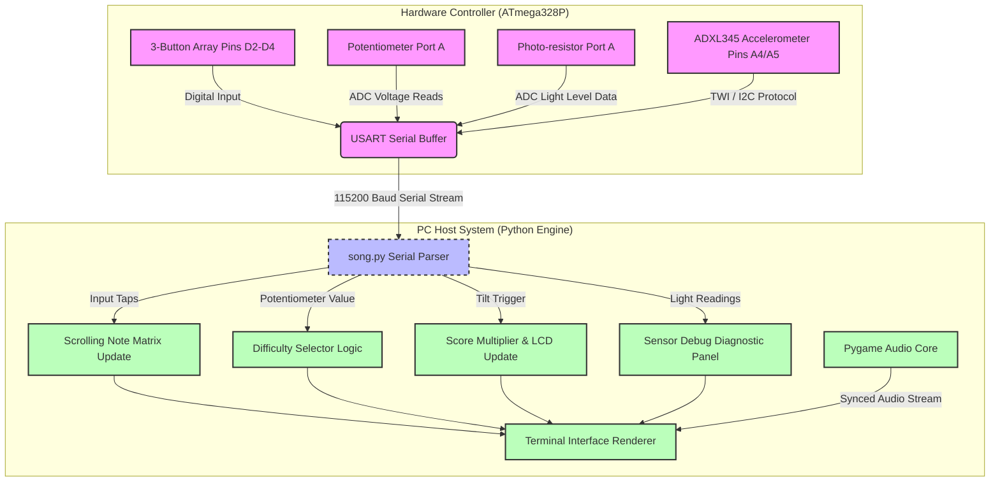
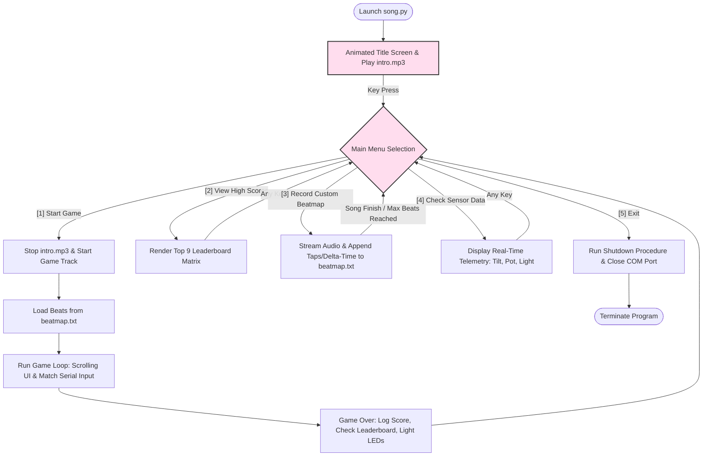

# THE BEAT DOWN! 🥁🚹

**THE BEAT DOWN!™** is an immersive, retro arcade-style rhythm game that bridges a custom hardware controller with an interactive desktop user interface. 

The system operates on a split-runtime architecture to bypass the 32KB flash memory constraints of the ATmega328P microcontroller: an **Arduino Uno** handles rapid hardware polling, sensor reads, and LED/LCD updates, while a companion **Python terminal engine** executes real-time graphics rendering, manages your custom beatmaps, and streams synchronized audio.

---

## 🏗️ System Architecture

The workload is split across a hardware-software pipeline connected via a serial bus optimized at a high-speed **115200 Baud rate** for dynamic rendering.

```
+---------------------------------------+         USART Serial        +---------------------------------------+
|          HARDWARE CONTROLLER          |      (115200 Baud Rate)     |             PC SYSTEM HOST            |
|  - ATmega328P Microcontroller         |  ========================>  |  - Python Script (song.py)            |
|  - 3-Lane Button Tapping Array        |  <========================  |  - Pygame Audio Core Subsystem        |
|  - Tri-Sensor Suite (Debug/Modifiers) |                             |  - Framed Terminal Interface Rendering|
|  - LCD & LED Feedback Indicator Setup |                             |  - Custom Beatmap File Storage        |
+---------------------------------------+                             +---------------------------------------+
```

### 1. Hardware Integration & Sensor Suite
The custom control deck incorporates a physical layout mapped directly to gameplay variables:
* **3-Button Array:** Tactile micro-switches connected to pins **D2, D3, and D4**, mapped to the Left, Middle, and Right music lanes.
* **Potentiometer (Analog Input):** Connected to Port A. Maps raw voltage data to three distinct game difficulty tiers: **Easy**, **Medium**, and **Difficult**.
* **Photo-resistor (Analog Input):** Connected to Port A. Measures ambient light levels. *(Note: Relegated to the real-time sensor diagnostic menu due to upstream timer/audio pause state complexities)*.
* **Digital Accelerometer (ADXL345 via TWI/I2C):** Connected to Port A (Pins A4/A5). Evaluates physical X-axis tilt to display a "Ready" notification on the LCD and activate a **2x Score Multiplier** power-up.
* **Output Display & Indicators:** An **LCD Display** provides secondary text feedback (e.g., power-up status), while a **Blue LED** flashes for successful notes and a **Red LED** lights up for misses or faulty timing windows.

### 2. Software Framework (`song.py`)
The desktop client handles performance-heavy tasks:
* **Dynamic Terminal Interface:** Renders a vertical scrolling note matrix using an `o` visual graphic to simulate falling notes down columns, enabling users to anticipate button presses.
* **Audio Engine:** Streams stutter-free background tracks (`intro.mp3`) during menus and loads full-track audio (`Goodness Gracious.mp3`) during live gameplay loops.

---

## 📂 Project Structure

```text
├── song.py               # Core PC engine (Serial interface, UI rendering, audio playback)
├── beatmap.txt             # CSV file containing timestamped delta time paired with target lane integers
├── intro.mp3               # Audio track looped during the start screen and main menu
└── Goodness Gracious.mp3   # The primary interactive gameplay music track
```

---

## 📊 Process Flowcharts

### 1. Hardware-to-PC Flowchart
This flowchart visualizes how data streams from your hardware inputs through USART serial communication into the core Python game engine modules.



### 2. Main Menu Logic
This diagram outlines the program's execution options across the 5 distinct operational modes handled by the script.



---

## 📸 Gameplay Screenshots

### Title Screen


### Main Menu


### Live Gameplay Board


### High Scores Leaderboard


### Real-Time Sensor Data


---

---

## 🚀 Installation & Setup

### Prerequisites
1. **Python 3.8+** installed on your host system.
2. Core dependencies installed via pip:
   ```bash
   pip install pygame pyserial
   ```
3. An **ATmega328P / Arduino Uno development kit** loaded with your companion firmware code.

### Execution
1. Open `song.py` and modify the target `PORT` string to match your environment connection (e.g., 'COM5' on Windows, or '/dev/ttyUSB0' on Linux/macOS).
2. Connect your physical control deck to your device via USB.
3. Launch the central executable script directly from your terminal terminal:
   ```bash
   python song.py
   ```

---

## 🎮 Operational Modes

Navigate through 5 central selection profiles via the main terminal command prompt:
* **`[1] Start Game`:** Halts the menu music loop, processes target timestamps from `beatmap.txt`, updates the active scrolling grid UI, evaluates tap timing offsets, and flashes the corresponding hardware score LEDs.
* **`[2] View High Scores`:** Accesses your historical top 9 scorecard matrix alongside custom player initials.
* **`[3] Record Custom Beatmap`:** Streams selected audio tracks while capturing real-time hardware button inputs, saving structured delta-time markers into `beatmap.txt`.
* **`[4] Check Sensor Data`:** Boots a live telemetry monitoring view to troubleshoot incoming accelerometer angles, potentiometer dials, and photo-resistor light shifts instantly.
* **`[5] Exit`:** Safe-closes your listening serial COM channel, kills active Pygame audio threads, and terminates process flags cleanly.

---
